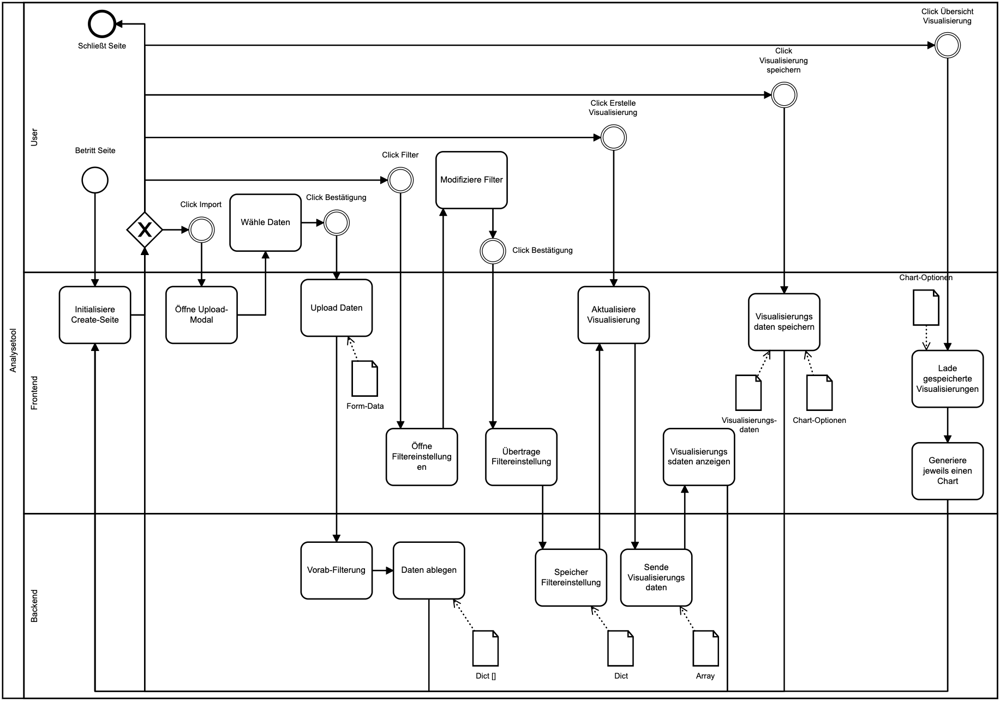

# TraDAsys
This project contains the implementation to my bachelor thesis "Concept and Implementation of a Data Analysis Tool for Body Tracking Cameras".
The thesis is published on https://fietkau.science/teaching#bsc_temiz.

## Documentation
The full code documentation can be found in the 4th chapter of my thesis.

### Components
The tool is divided in two systems. 
The angular based frontend is build for user interactions, data input and visualization of the uploaded data.

The python based backend is responsible for translating the input data to arrays.
Decisive for the structure of the backend is the used library
[Flask-RESTful](https://flask-restful.readthedocs.io/en/latest/).

Additionally the backend filters the data according to the passed filter parameters.

For this purpose, the method "filterRecord()" is called, which invokes the respective filter methods.
To add a new filter, the method name must be included in the array of the "filterRecord()" method.
The new method must return a Record[] and has at least one Record[] as parameter.

### UML-Diagramm:
Written documentation on p. 26

### BPMN Diagram
Written documentation on p. 20

